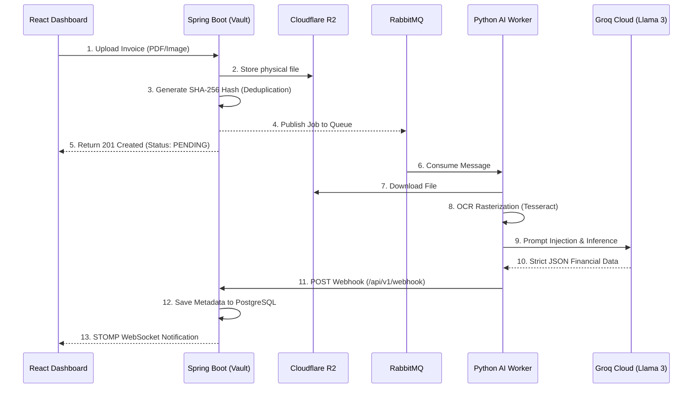

# avenra-flow
Avenra FLOW 🌊 | An event-driven, multi-tenant FinTech architecture for automated invoice data extraction. Built with Spring Boot, PostgreSQL, RabbitMQ, and a Python AI Worker powered by Groq (Llama-3).
# Avenra FLOW 🌊
**Enterprise-Grade Automated Invoice Processing Architecture**

Avenra FLOW is a distributed, event-driven FinTech platform designed to ingest, parse, and categorize financial documents at scale. It utilizes a stateless Java backend, an asynchronous Python AI worker, and a real-time React frontend to create a seamless, zero-block document processing pipeline.

## 🏗️ System Architecture

Avenra FLOW implements the **Choreographed Microservices** pattern to decouple heavy AI processing from the high-speed web server.

✨ Core Features
Multi-Tenant Isolation: Built-in organizational structure. Users are bound to specific Workspaces with Role-Based Access Control (OWNER, ADMIN, VIEWER) secured via stateless JWTs.

Cryptographic Deduplication: Files are hashed via SHA-256 upon upload. If a duplicate file fingerprint is detected within a tenant's vault, the transaction is rejected instantly, saving compute and storage costs.

Asynchronous AI Processing: Heavy OCR (Tesseract/pdf2image) and LLM inference (Llama-3 8B via Groq) are entirely offloaded to an independent Python worker via RabbitMQ, ensuring the Java API never blocks.

Real-Time Telemetry: The Spring Boot backend maintains an active STOMP WebSocket connection with the client, pushing live UI updates the exact millisecond the AI finishes extracting financial metadata.

Zero-Egress Storage: Physical documents are streamed directly to Cloudflare R2 (S3-compatible) for highly available, cost-effective edge storage.

🛠️ Tech Stack
The Vault (Core API)
Framework: Java 21 / Spring Boot 4.0.x

Security: Spring Security, JWT, OAuth2 (Google)

Database: PostgreSQL with Spring Data JPA / Hibernate

Storage: AWS SDK v2 (pointed to Cloudflare R2)

The Worker (AI Engine)
Language: Python 3.10+

Messaging: Pika (AMQP 0-9-1)

Vision: Pillow, pdf2image, Tesseract-OCR

Cognition: Groq Cloud API (llama-3.1-8b-instant) forced to strict JSON schema.

🚀 Getting Started (Local Development)
1. Prerequisites
Java 17+ and Maven

Python 3.10+

PostgreSQL (Running on port 5432)

RabbitMQ (Running on port 5672)

Tesseract-OCR installed on your system path.

2. Environment Setup
# Cloudflare R2 Configuration
R2_ACCESS_KEY=your_key
R2_SECRET_KEY=your_secret
R2_BUCKET_NAME=avenra-vault
R2_ENDPOINT=https://<account_id>.r2.cloudflarestorage.com
R2_PUBLIC_DOMAIN=[https://pub-xxxx.r2.dev](https://pub-xxxx.r2.dev)

# Security & DB
JWT_SECRET=your_secure_random_string
DB_USERNAME=postgres
DB_PASSWORD=your_password

# External APIs
GROQ_API_KEY=gsk_your_groq_key

3. Ignition
Boot the Spring Boot Server:
./mvnw spring-boot:run

Boot the Python Worker:

cd ai-worker
python -m venv venv
source venv/bin/activate  # Or venv\Scripts\activate on Windows
pip install -r requirements.txt
python worker.py

